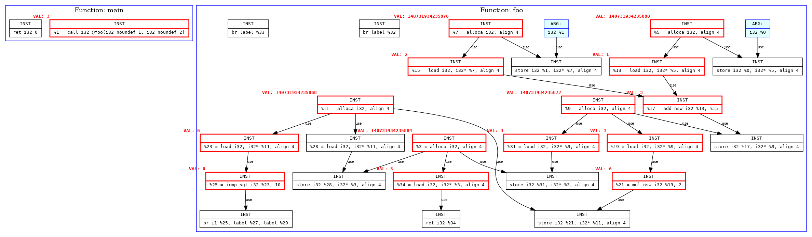
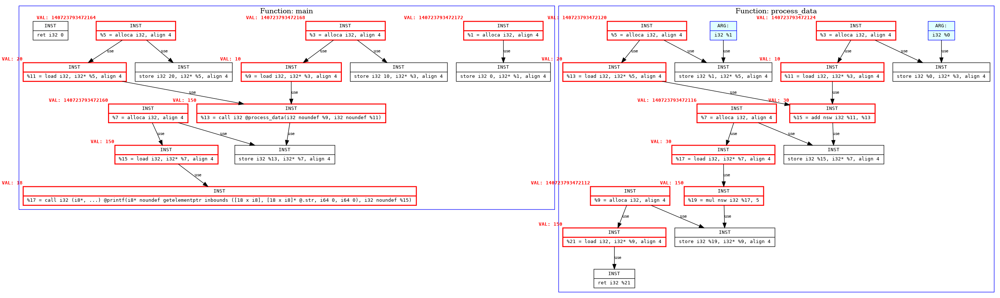

# LLVM Def-Use Dynamic Analyzer


## Build and Run Instruction

```bash
mkdir build
cd build
cmake ..
make
```
Prepare tests/test1.c and tests/test2.c files

```bash
cd ..
chmod +x run.sh
./run.sh
```
Tests
```bash
./build/unit_tests
```
# Example of result graph
One module

Two modules

