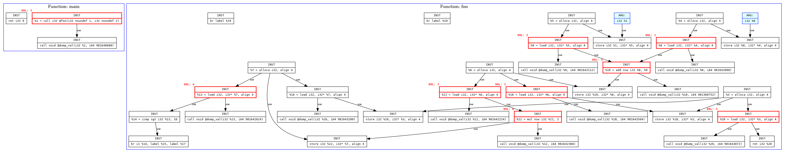

# LLVM Def-Use Dynamic Analyzer


## Build and Run Instruction

```bash
mkdir build
cd build
cmake -DCMAKE_BUILD_TYPE=Debug ..
make
```
Prepare tests/test.c file

# TODO[flops]: Make script for this
```bash
cd ..
chmod +x run.sh
./run.sh
```


